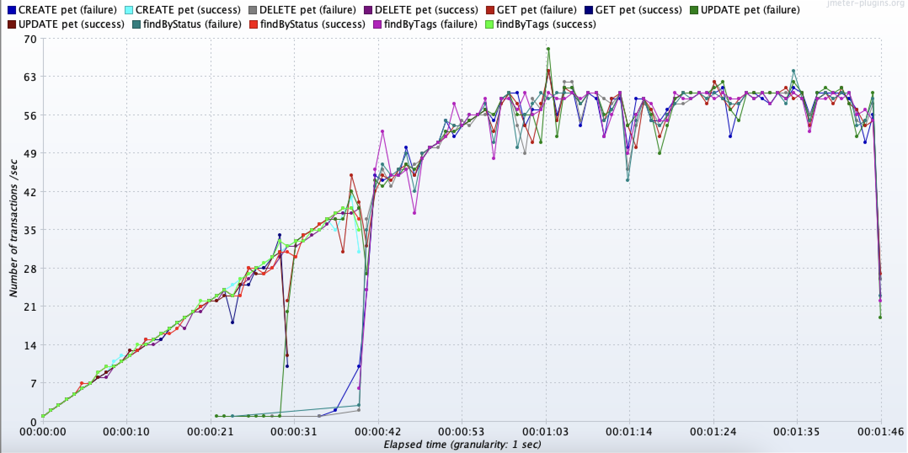
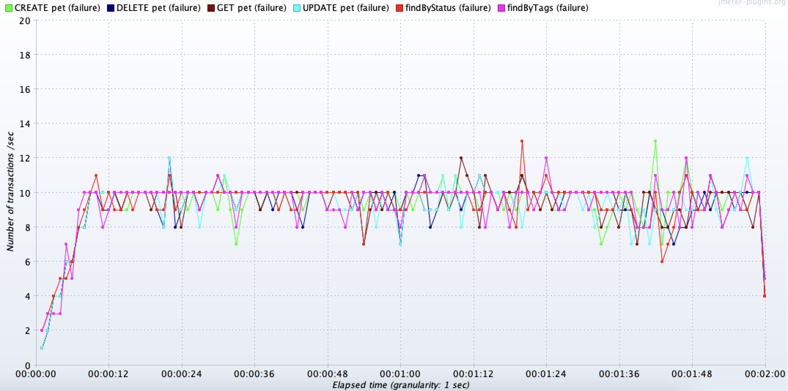
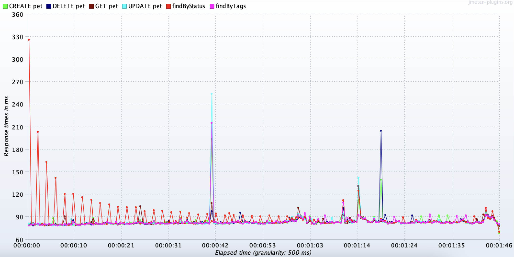

# Test Cases for Swagger Pet Store API

## Test Case 1: Find Pet by ID
**Purpose:** Verify that a pet can be retrieved by its ID.
### Test Steps:
1. **Send a GET request** to `/api/v3/pet/{id}` with a valid pet ID.
2. **Verify** that the response status code is `200`.
3. **Validate** that the response body contains the correct pet details for the given ID.
### Expected Results:
- **Status Code:** 200
- **Response Body:** Contains details of the pet corresponding to the provided ID.
### Test Data:
- **Valid Pet ID:** 1, 2, 3
---

## Test Case 2: Find Pets by Status
**Purpose:** Verify that pets can be retrieved by their status.
### Test Steps:
1. **Send a GET request** to `/api/v3/pet/findByStatus` with `status=available` as a query parameter.
2. **Verify** that the response status code is `200`.
3. **Validate** that all returned pets have the status "available".
### Expected Results:
- **Status Code:** 200
- **Response Body:** All pets should have the status "available".
### Test Data:
- **Status:** "available"
---

## Test Case 3: Add a New Pet
**Purpose:** Verify that a new pet can be added to the store.
### Test Steps:
1. **Send a POST request** to `/api/v3/pet` with a request body containing new pet details.
2. **Verify** that the response status code is `200`.
3. **Validate** that the response body matches the details of the added pet.
### Expected Results:
- **Status Code:** 200
- **Response Body:** Contains the details of the newly added pet.
### Test Data:
- **New Pet JSON:**
---

## Test Case 4: Update an Existing Pet
**Purpose:** Verify that an existing pet's details can be updated.
### Test Steps:
1. **Send a POST request** to /api/v3/pet with pet details to create it (if not already created).
2. **Send a PUT request** to /api/v3/pet with updated pet details.
3. Verify that the response status code is 200.
4. **Send a GET request** to /api/v3/pet/{id} to retrieve the updated pet details.
5. Validate that the updated pet details are reflected in the response.
### Expected Results:
- PUT Status Code: 200
- GET Response Body: Contains updated details of the pet.
### Test Data:
- **Update Pet JSON:**
---

## Test Case 5: Delete a Pet
**Purpose:** Verify that a pet can be deleted from the store.
### Test Steps:
1. Send a POST request to /api/v3/pet with pet details to create it (if not already created).
2. Send a DELETE request to /api/v3/pet/{id}.
3. Verify that the response status code is 200.
4. Send a GET request to /api/v3/pet/{id} to verify that the pet has been deleted.
### Expected Results:
DELETE Status Code: 200
GET Status Code: 404 (indicating the pet no longer exists)
### Test Data:
- Pet ID: 12
- **Detele Pet JSON:**
---

# Performance Test Plan for Swagger Petstore API

## Overview
The purpose of this performance test is to evaluate the scalability and stability of the Swagger Petstore APIs under different conditions. The goal is to identify potential performance bottlenecks that could impact user experience or overall functionality.

## Test Scenarios

### 1. Stress Test Profile
- **Objective:** Determine how the API performs under high load conditions and identify the maximum number of concurrent users the system can handle before failures occur.
- **Test Configuration:**
  - **Number of Users:** 30
  - **Ramp-Up Time:** 60 seconds
  - **Test Duration:** 120 seconds
- **Results:**
  - **Initial Observation:** The first 500 errors were observed at 20 seconds.
  - **Performance Limitation:** The endpoint is stable with a maximum of 10 concurrent users before server restart is needed.

**Graph:**


### 2. Load Testing
- **Objective:** Assess the API's performance under a normal load to ensure it meets performance requirements.
- **Test Configuration:**
  - **Number of Users:** 5
  - **Ramp-Up Time:** 30 seconds
  - **Test Duration:** 120 seconds
  - **Request Rate:** 10 requests per second
- **Results:**
  - **Observation:** The API maintained stable performance with a transaction rate of 10 requests per second.

**Graph:**


### 3. Endurance Testing
- **Objective:** Validate that the API can handle a sustained load over an extended period without degradation in performance.
- **Test Configuration:**
  - Pending

### 4. Spike Testing
- **Objective:** Examine the API's behavior under sudden and extreme spikes in load to evaluate its ability to handle unexpected traffic bursts.
- **Test Configuration:**
  - Pending

### 5. Scalability Testing
- **Objective:** Assess how the API scales with an increasing number of users to ensure it meets future growth requirements.
- **Test Configuration:**
  - Pending

## Observations

1. **Stress Test Profile:**
   - **Initial Findings:** The endpoint experienced the first 500 errors at 20 seconds. The API is able to handle up to 10 concurrent users reliably before requiring a server restart.

2. **Load Testing Profile:**
   - **Observation:** The API maintained stable performance with a transaction rate of 10 requests per second, using a load of 5 users.

3. **Response Time Analysis:**
   - **Consistency:** The response time is stable for all endpoints, with consistent average response times.
   - **Find by Status Endpoint:** The response time for the "find by status" endpoint, which returns a list of pets filtered by availability, decreases exponentially and stabilizes around 100 ms. This behavior suggests that the endpoint may utilize a caching mechanism like Redis to improve response times with repeated calls.

**Graph:**


## Conclusion
The performance tests reveal that the API performs adequately under normal conditions but encounters limitations under high load. The caching mechanism used for the "find by status" endpoint contributes to improved performance and reduced response times with repeated queries.

---

*Note: Attach the actual performance test graph images by replacing the placeholder paths.*


# Swagger Petstore Sample

## Overview
This is the pet store sample hosted at https://petstore3.swagger.io. For other versions, check the branches.
We welcome suggestion both the code and the API design.
To make changes to the design itself, take a look at https://github.com/swagger-api/swagger-petstore/blob/master/src/main/resources/openapi.yaml.

This is a java project to build a stand-alone server which implements the OpenAPI 3 Spec.  You can find out
more about both the spec and the framework at http://swagger.io.

This sample is based on [swagger-inflector](https://github.com/swagger-api/swagger-inflector), and provides an example of swagger / OpenAPI 3 petstore.

### To run (with Maven)
To run the server, run this task:

```
mvn package jetty:run
```

This will start Jetty embedded on port 8080.

### To run (via Docker)

Expose port 8080 from the image and access petstore via the exposed port. You can then add and delete pets as you see fit.


*Example*:

```
docker build -t swaggerapi/petstore3:unstable .
```

```
docker pull swaggerapi/petstore3:unstable
docker run  --name swaggerapi-petstore3 -d -p 8080:8080 swaggerapi/petstore3:unstable
```


### Testing the server
Once started, you can navigate to http://localhost:8080/api/v3/openapi.json to view the Swagger Resource Listing.
This tells you that the server is up and ready to demonstrate Swagger.

### Using the UI
There is an HTML5-based API tool bundled in this sample--you can view it it at [http://localhost:8080](http://localhost:8080). This lets you inspect the API using an interactive UI.  You can access the source of this code from [here](https://github.com/swagger-api/swagger-ui)
